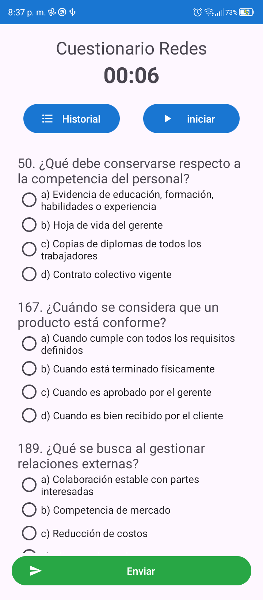
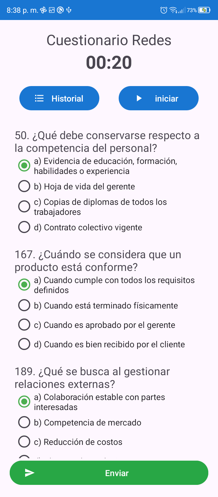
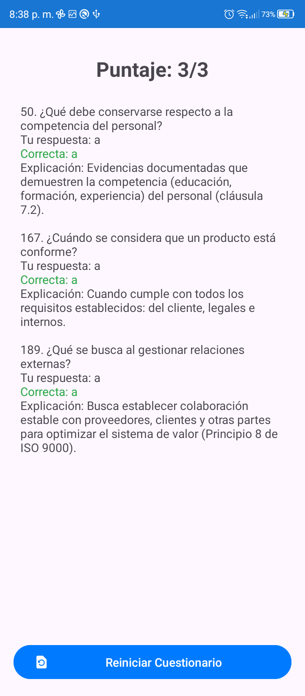
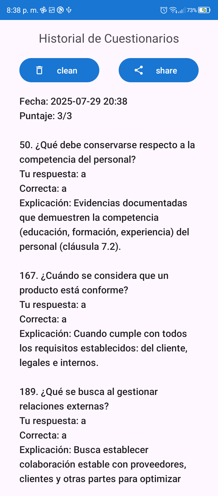
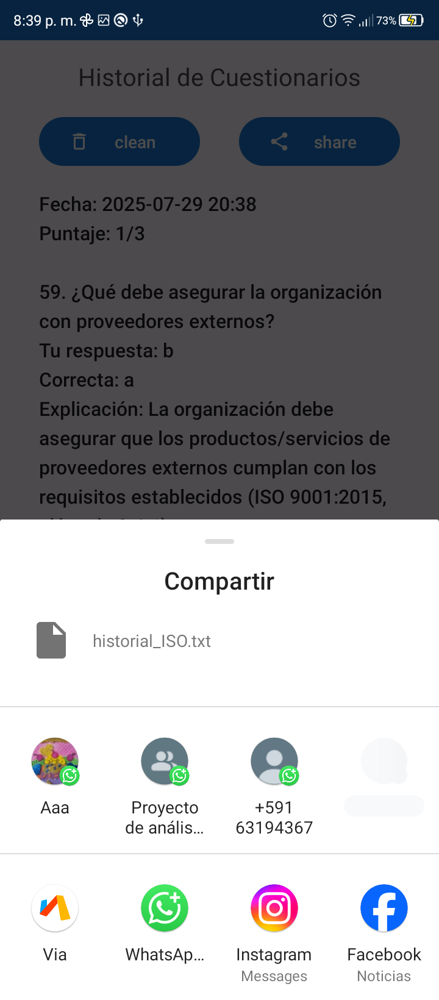

#Quiz
Una aplicacion personal de cuestionarios en Android para estudiar preguntas ya sean de selección multiple o falso/verdadero.\
Uso:\
Solo es necesario hacer cambios en el el archivo .json con las preguntas que quieras estudiar.\
Uso por parte del usuario:\
Apareceran preguntas(según la configuracion) aleatorias falso/verdarero o de seleccion multiple, al responder todas las preguntas, estas se calificaran.\
La aplicacion cuenta con un algoritmo que no permite que las preguntas se repitan hasta que se usen todas, brinda posibilidad de reinicion al 
agotar las preguntas, verificar el historial de todas las preguntas, y la opciión de compartirlas en formato .txt para su posterior verificación.
Inicio de la aplicacion:\

\
Layout de calificación de respuestas:
\
Historial de preguntas y sus respuestas:\

Autor:\
@Ahjin-arch
